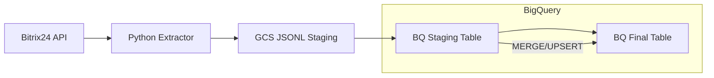

# Bitrix24 to BigQuery Data Pipeline


Production-grade ELT pipeline synchronizing Bitrix24 CRM entities (leads, deals, contacts, activities) to Google BigQuery using GCS as a staging layer.

## Architecture Overview

The pipeline follows the **ESLM** (Extract → Stage → Load → Merge) pattern to ensure data consistency, idempotency, and resilience to API rate limits.



## Environment Variables

| Variable | Description | Mandatory |
| :--- | :--- | :---: |
| `BITRIX_WEBHOOK_URL` | Bitrix24 REST API webhook URL | Yes |
| `GCP_PROJECT_ID` | Google Cloud Project ID | Yes |
| `GCS_BUCKET` | GCS bucket name for staging | Yes |
| `BQ_RAW_DATASET` | Dataset for raw/audit tables | No (default: bitrix_raw) |
| `BQ_STAGING_DATASET` | Dataset for temporary staging tables | No (default: bitrix_staging) |
| `BQ_FINAL_DATASET` | Dataset for final production tables | No (default: bitrix_final) |
| `CHUNK_SIZE` | Number of records per GCS file | No (default: 5000) |
| `FORCE_FULL_SYNC` | Ignore watermarks and perform full sync | No (default: false) |
| `START_DATE_OVERRIDE` | Force extraction from a specific ISO date | No |

## Local Development

### Run with Docker
1. Build the image:
   ```bash
   docker build -t bitrix-sync .
   ```
2. Run the container:
   ```bash
   docker run --env-file .env \
     -v $(pwd)/credentials:/app/credentials \
     -e GOOGLE_APPLICATION_CREDENTIALS=/app/credentials/service-account.json \
     bitrix-sync
   ```

### Run Tests
```bash
pytest tests/ -v
```

## Infrastructure Deployment

Infrastructure is managed via Terraform.

```bash
cd infra/terraform/environments/prod
terraform init
terraform apply
```

## Documentation
- [Architecture Details](docs/architecture.md)
- [Operational Runbook](docs/runbook.md)
- [Changelog](CHANGELOG.md)
