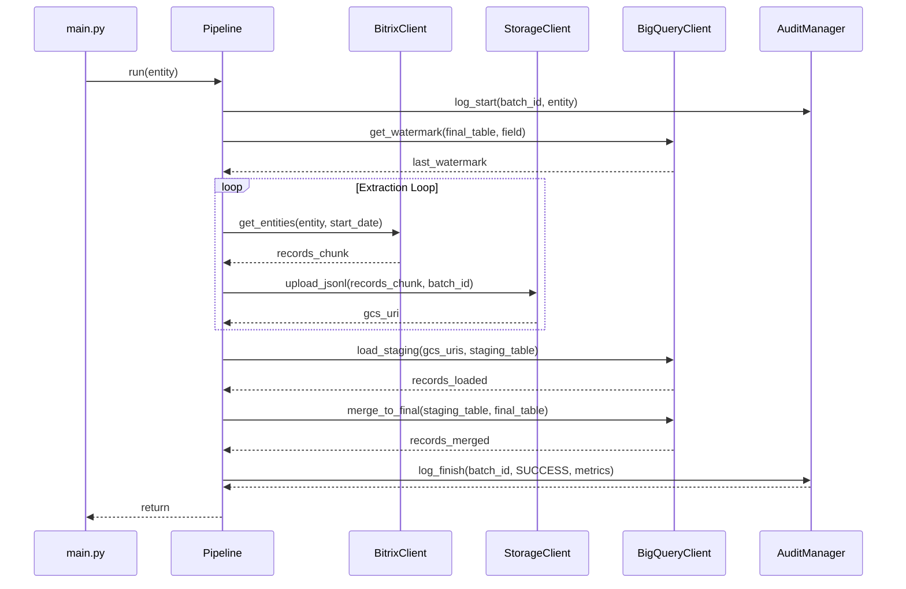

# Architecture

This document describes the high-level architecture of the Bitrix24 to BigQuery data pipeline.

## ESLM Pattern
The pipeline implements the **Extract-Stage-Load-Merge** pattern:

1.  **Extract**: Python application fetches data from Bitrix24 REST API.
2.  **Stage**: Data is serialized to Newline Delimited JSON (JSONL) and uploaded to GCS.
3.  **Load**: JSONL files are loaded from GCS into a temporary BigQuery staging table.
4.  **Merge**: An atomic `MERGE` statement synchronizes the staging data with the final production table, handling inserts, updates, and deduplication.

## GCP Components

### Google Cloud Storage (GCS)
Acts as the intermediate durability layer.
- **Path structure**: `bitrix/{entity_name}/load_date=YYYY-MM-DD/batch_id={uuid}/part-{n}.jsonl`
- This partitioning allows for easy data discovery and reprocessing.

### BigQuery Dataset Hierarchy
1.  **Raw Dataset (`bitrix_raw`)**: Contains the `pipeline_audit` table and any persistent raw tables if needed.
2.  **Staging Dataset (`bitrix_staging`)**: Holds transient tables used during the `MERGE` process.
3.  **Final Dataset (`bitrix_final`)**: The source of truth for analytical queries. Tables are partitioned by the watermark field (e.g., `DATE_MODIFY`).

### IAM Roles Required
The Service Account executing the job requires:
- `roles/storage.objectAdmin` on the staging bucket.
- `roles/bigquery.jobUser` on the project.
- `roles/bigquery.dataEditor` on the target datasets.
- `roles/secretmanager.secretAccessor` on the webhook secret.

## Incremental Sync Strategy
The pipeline uses a "watermark" approach. For each run, it queries the final BigQuery table for the `MAX(watermark_field)`. Only records modified after this timestamp are extracted from Bitrix24.

## Pipeline Audit
Every run is tracked in the `pipeline_audit` table:
- `batch_id`: Unique identifier for the run.
- `status`: RUNNING, SUCCESS, or FAILED.
- `records_extracted`, `records_loaded`, `records_merged`: Metrics for monitoring.
- `error_message`: Captured in case of failure.

Query run history:
```sql
SELECT * FROM `bitrix_raw.pipeline_audit` ORDER BY started_at DESC
```

## Sequence Diagram


